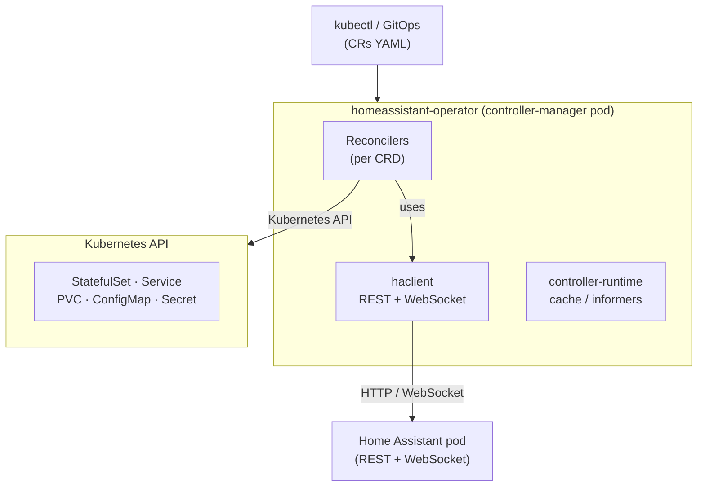
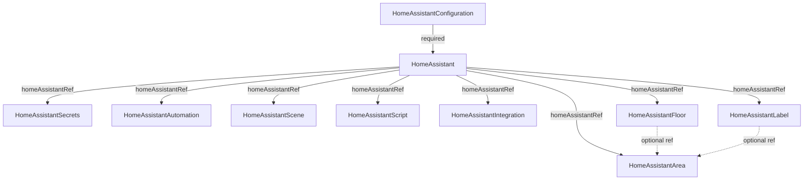
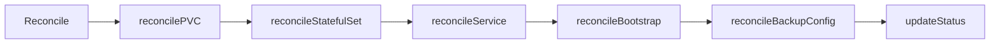
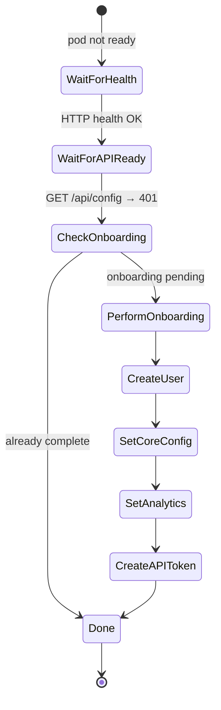
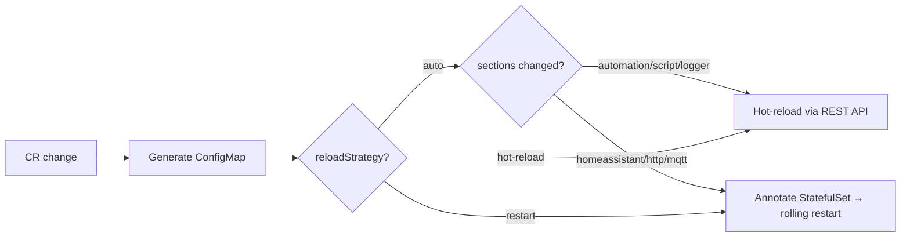
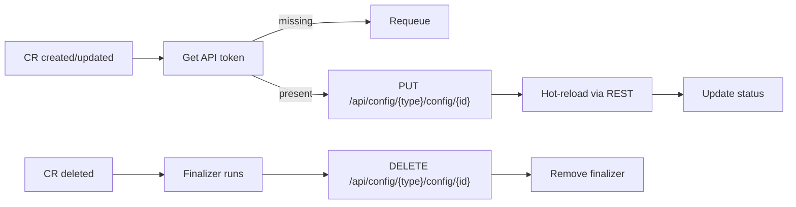
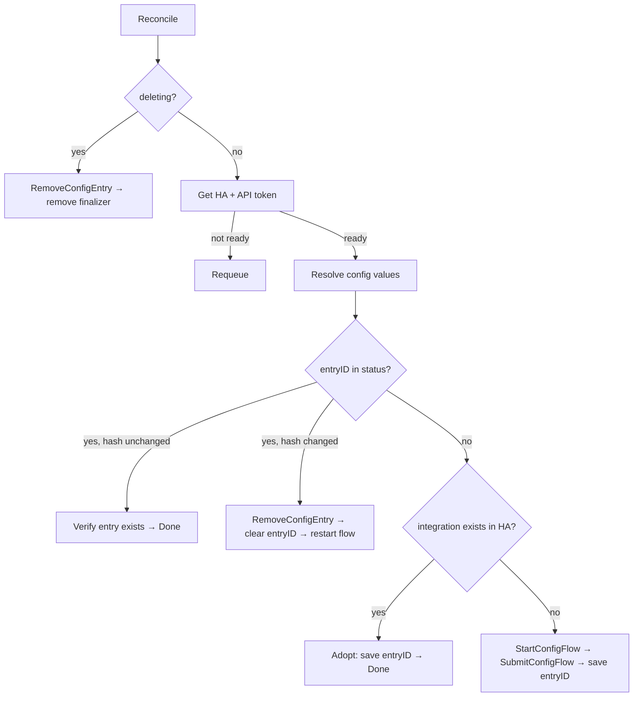
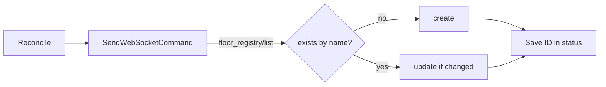

# Architecture

## Overview

Home Assistant Operator is a [Kubebuilder v4](https://book.kubebuilder.io/) operator that manages Home Assistant instances on Kubernetes declaratively. It bridges the gap between Kubernetes resource management and the Home Assistant REST/WebSocket API.



## CRD dependency chain

All CRDs form a strict dependency graph. The operator enforces it — a CRD requeues (waits) until its dependency is ready.



**Recommended apply order:**

1. `HomeAssistantConfiguration` + `HomeAssistant` (simultaneously or config first)
2. `HomeAssistantSecrets` (optional)
3. `HomeAssistantFloor`, `HomeAssistantLabel` (optional, for room structure)
4. `HomeAssistantArea` (optional, depends on Floor/Label)
5. `HomeAssistantAutomation`, `HomeAssistantScene`, `HomeAssistantScript`, `HomeAssistantIntegration` (optional, require bootstrap token)

## Reconciliation flows

### HomeAssistant

The core reconciler orchestrates the full lifecycle.



**reconcileStatefulSet** builds the StatefulSet spec from:

- `spec.version` → container image tag
- `spec.resources` → CPU/memory limits
- `spec.storage` → PVC claim template
- `spec.service`, `spec.ingress` → Service/Ingress resources
- `spec.hostNetwork` → enables mDNS/SSDP discovery
- Config hash annotations from `HomeAssistantSecrets` and `HomeAssistantConfiguration` → rolling restarts

**reconcileBootstrap** is a state machine that drives the onboarding flow:



### HomeAssistantConfiguration

Manages `configuration.yaml` as a Kubernetes-native resource.



Auto-include: the controller automatically injects `automation: !include automations.yaml`, `scene: !include scenes.yaml`, and `script: !include scripts.yaml` into `configuration.yaml` if missing — required for HA to load resources managed by the operator.

### HomeAssistantAutomation / Scene / Script

Each CR maps to a single entity in HA via the REST config API. No ConfigMap aggregation.



HA persists these resources in `automations.yaml`, `scenes.yaml`, `scripts.yaml` on the PVC — they survive pod restarts.

### HomeAssistantIntegration

Manages HA integrations through the Config Flow API.



### HomeAssistantFloor / Label / Area

These CRDs manage the HA room structure via the WebSocket registry API (no REST equivalent).



Area resolution: `floorName` → Floor CR → `status.floorID`; `labels[]` → Label CRs → `status.labelID`s. If a Floor/Label is not yet ready, Area requeues (30 s) — no explicit watch relationship needed.

## Key mechanisms

### Owner references and garbage collection

All sub-resources created by the operator carry an owner reference pointing to their parent CR. When the CR is deleted, Kubernetes garbage-collects owned resources automatically.

```go
controllerutil.SetControllerReference(owner, child, scheme)
```

Resources owned by `HomeAssistant`: `StatefulSet`, `Service`, `PVC`.
Resources owned by `HomeAssistantConfiguration`: the generated `ConfigMap`.
Resources owned by `HomeAssistantSecrets`: the aggregated `ConfigMap`.

### Finalizers

`HomeAssistantAutomation`, `HomeAssistantScene`, `HomeAssistantScript`, `HomeAssistantIntegration`, `HomeAssistantFloor`, `HomeAssistantLabel`, `HomeAssistantArea` all use finalizers to clean up their corresponding HA entities before the CR is removed. Cleanup is best-effort — if HA is unavailable, the finalizer is still removed so the CR is not left stuck.

### Config hash annotations

`HomeAssistantSecrets` and `HomeAssistantConfiguration` each write a SHA-256 hash of their generated content into a pod template annotation on the `StatefulSet`. Kubernetes detects the annotation change as a pod template mutation and performs a rolling restart.

```
ha.homeassistant.io/secrets-hash: sha256:abc123...
ha.homeassistant.io/config-hash:  sha256:def456...
```

A `sync.Map`-based debounce guard in `HomeAssistantReconciler` prevents a burst of hash updates from triggering multiple consecutive rollouts.

### Hot-reload with retry

`reload_helpers.go` (`PerformReloadWithRetry`) provides shared logic for automation, scene, and script controllers:

1. `IsComponentLoaded()` — confirms the integration is loaded in HA before attempting reload
2. 3 attempts × 5 s delay, each tagged with a unique `ReloadID` for log correlation
3. Graceful degradation — exhausted retries do not fail the reconciliation; HA will pick up the change on the next restart

### Dependency injection for testing

Reconcilers that call the HA API expose a `NewHAClient` field:

```go
type HomeAssistantAutomationReconciler struct {
    ...
    NewHAClient func(baseURL string) *haclient.Client
}
```

Tests wire in an `httptest.Server` instead of a real HA instance, keeping unit tests fast and hermetic.

## Package structure

```
api/v1/          CRD type definitions (edit here, then make manifests generate)
cmd/main.go            Entry point — registers all controllers
internal/
  controller/          One reconciler per CRD
    reload_helpers.go  Shared hot-reload with retry
    auto_include.go    Auto-inject !include lines into configuration.yaml
    bootstrap_controller.go  HA onboarding state machine
    backup_controller.go     Backup config via WebSocket
    helpers.go         Shared utilities (status, conditions)
  haclient/
    client.go          HTTP + WebSocket client (bootstrap, reload, config entries, backup)
test/
  e2e/                 Ginkgo/Gomega E2E tests (require k3d cluster)
  utils/timeouts.go    Centralised E2E timeouts
charts/
  homeassistant-operator/  Helm chart
config/
  crd/bases/           Generated CRD manifests (do not edit manually)
  rbac/                Generated RBAC manifests
  samples/             Example CRs for all CRDs
```

## HA client (`internal/haclient`)

The `haclient.Client` wraps all communication with Home Assistant:

| Method | Transport | Purpose |
|--------|-----------|---------|
| `CheckHealth` | REST | Health probe |
| `CheckAPIReady` | REST | API readiness gate (401 = ready, 404 = not yet) |
| `PerformBootstrap` | REST | Full onboarding flow |
| `ReloadAutomations/Scenes/Scripts` | REST | Hot-reload after config change |
| `PutAutomation/Scene/Script` | REST | Create or update single entity |
| `DeleteAutomation/Scene/Script` | REST | Delete single entity (finalizer) |
| `IsComponentLoaded` | REST | Pre-reload integration check |
| `ListConfigEntries` / `IsIntegrationConfigured` | REST | Integration state |
| `StartConfigFlow` / `SubmitConfigFlow` | REST | Config Flow registration |
| `RemoveConfigEntry` | REST | Integration removal (finalizer) |
| `GetBackupConfig` / `ConfigureBackup` | WebSocket | Backup schedule management |
| `SendWebSocketCommand` | WebSocket | Generic one-shot WS helper |
